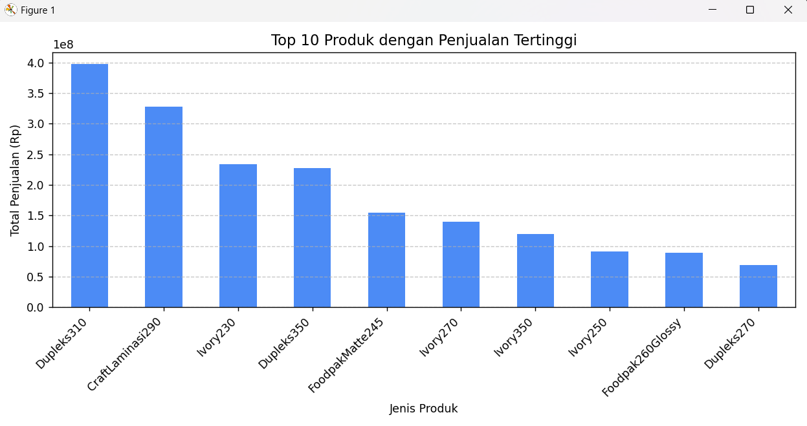
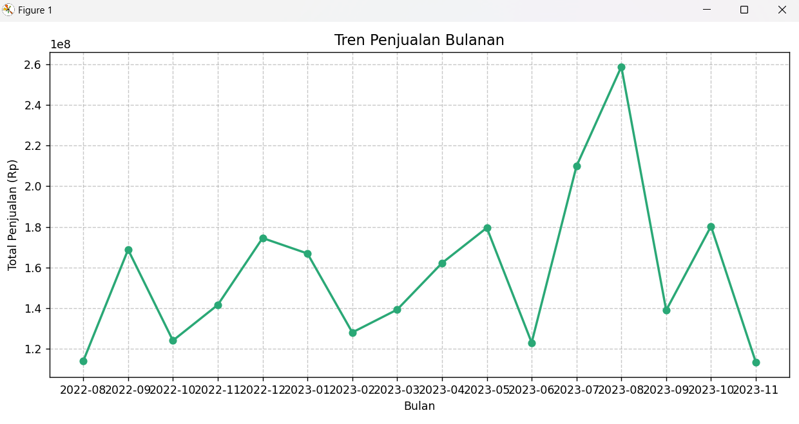

# 📊 Sales Analysis Beginner Project  
**By:** Muhammad Hafirst Firdaus  
**Goal:** Understanding basic data analysis workflow using Python and Excel dataset  

---

## 🧠 Project Overview  
This is my **first data analysis project** as a beginner Data Analyst.  
The dataset (`Project_Analisis_Penjualan_Pertama.xlsx`) contains sales transaction records of multiple products.  

This project focuses on exploring the data, identifying best-selling products, and understanding monthly sales trends.  
All analysis was done using **Python (Pandas & Matplotlib)**.

---

## 🎯 Objectives  
- Perform data cleaning and descriptive analysis.  
- Identify top-selling products.  
- Visualize sales trends and insights.  
- Provide conclusions and recommendations for improvement.  

---

## 🧩 Dataset Description  
| Column Name     | Description                          |
|-----------------|--------------------------------------|
| `Tanggal`       | Date of transaction                  |
| `Jenis Produk`  | Product type/name                    |
| `Jumlah Order`  | Number of units sold                 |
| `Harga`         | Price per unit                       |
| `Total`         | Total sales amount                   |
| `Bulan`         | Month of transaction                 |

🗂️ **Total records:** 1,076 rows  
📅 **Period covered:** Several months in 2022  
💾 **File:** `Project_Analisis_Penjualan_Pertama.xlsx`  

---

## 🧰 Tools Used  
- **Python 3.13**  
- **Libraries:** `pandas`, `matplotlib`  
- **Editor:** Visual Studio Code  
- **Data Source:** Internal dataset  

---

## 📈 Results and Key Insights  

### 🥇 Top-Selling Products
Based on the analysis:
- The top products are **CraftLaminasi290**, **Foodpak260**, and **FoodpakMatte245**.  
- These product lines contribute the most to total sales.  
- Kraft and food-safe packaging materials dominate the market.  

🖼️ **Visualization:**  

---

### 📅 Monthly Sales Trend  
- Sales fluctuate across months.  
- The highest peak was in **August**, likely due to promotional or seasonal factors.  
- Certain months show drops, indicating the need for stronger marketing consistency.  

🖼️ **Visualization:**  

---

### 💡 Key Insights Summary  
| Category | Key Finding |
|-----------|--------------|
| **Top Products** | Kraft & Foodpak series lead the market |
| **Sales Volume** | Overall positive but fluctuating |
| **Customer Preference** | Eco-friendly, food-safe materials preferred |
| **Recommendation** | Focus marketing and inventory on top sellers |

---

## 🧩 Conclusion  
The analysis reveals several important findings:

- **Total sales are strong**, but month-to-month performance varies.  
- The **Kraft and Foodpak** product lines dominate in revenue.  
- Maintaining **stock levels** and reinforcing **promotions during low months** will help stabilize performance.  
- This project demonstrates basic **data exploration, visualization, and storytelling** — essential skills for a **junior data analyst**.

---

## 🚀 Future Development Plan  
To improve this project further:

1. **Add Customer Segmentation** – Analyze customer profiles and behaviors.  
2. **Create Interactive Dashboard** – Using Power BI or Streamlit for real-time visuals.  
3. **Predictive Analysis** – Implement forecasting with Prophet or Scikit-learn.  
4. **Automated Reports** – Use Python to generate recurring analytics reports automatically.  

---

## 👨‍💻 About the Author  
**Name:** Muhammad Hafirst Firdaus  
🎓 **Program Studi:** Informatika – Universitas Sultan Ageng Tirtayasa  
📧 **Email:** [muhammadhafirst@gmail.com](mailto:muhammadhafirst@gmail.com)  

